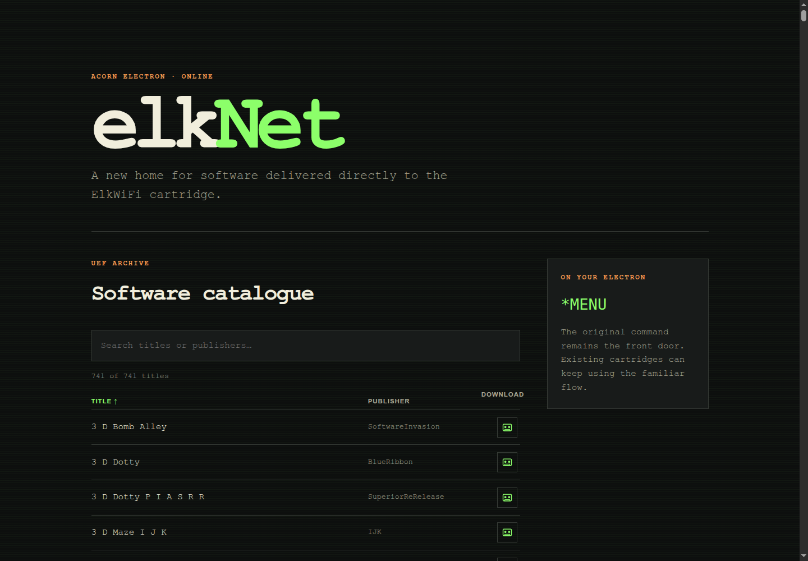
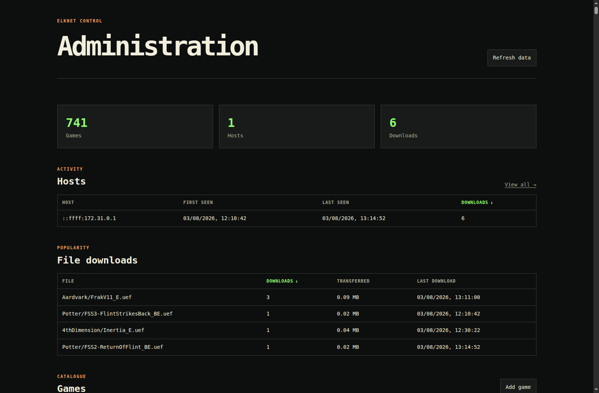
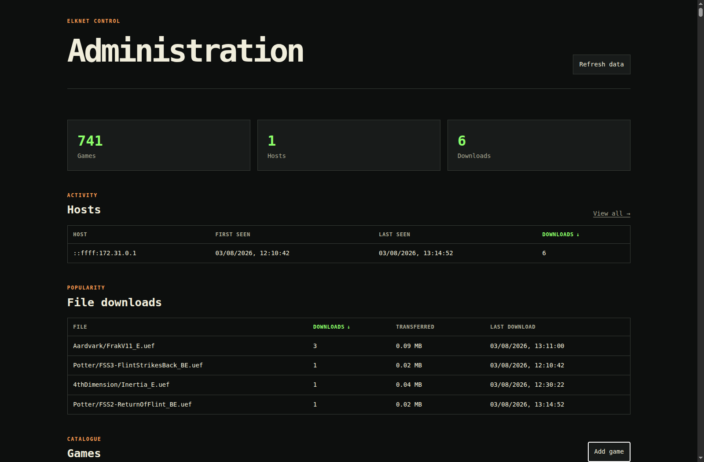
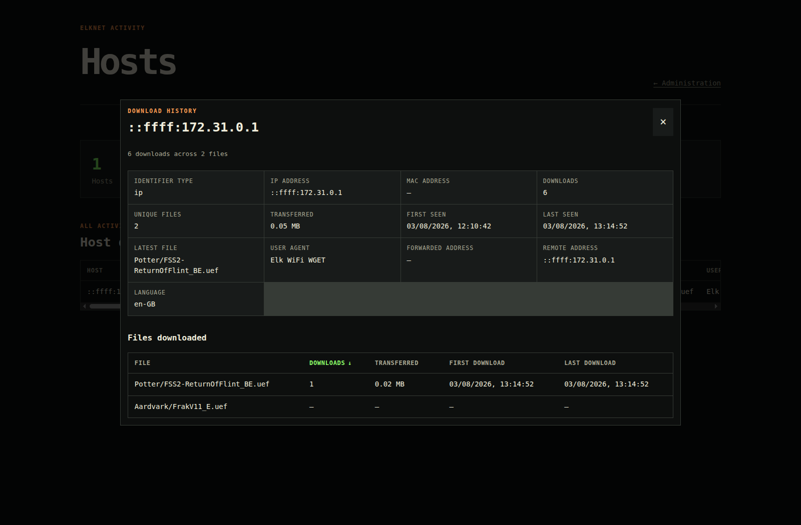

# elkNet

elkNet serves Acorn Electron tape images to original ElkWiFi cartridges and to
modern web browsers. It replaces the archive previously hosted at
`acornelectron.nl/uefarchive` without changing the URLs expected by the ROM.

The service has two interfaces:

- A public, searchable catalogue with direct UEF downloads.
- A protected administration area for catalogue maintenance and usage reports.

The cartridge interface is treated as a compatibility boundary. The web UI can
change, but `/uefarchive/MENU`, `/uefarchive/TITLES`, and the UEF download paths
must continue to return the byte streams expected by existing hardware.



## What the service provides

- A mirror of the original ElkWiFi UEF archive.
- Cartridge-compatible `MENU` and `TITLES` binaries.
- A searchable catalogue with sortable title, publisher, and availability
  columns.
- Raw and gzip-compressed UEF upload support. Compressed uploads are unpacked
  before storage.
- SHA-256 duplicate detection across enabled and disabled games.
- Separate display titles and archive filenames.
- Game add, edit, enable, disable, and remove operations.
- Support for adding publishers while preserving cartridge compatibility.
- Per-file download statistics.
- Host activity and per-host file download ledgers.
- A dependency-free Node.js HTTP server.
- A Docker image and Compose configuration.

## Requirements

For Docker operation:

- Docker Engine
- Docker Compose v2, or the older `docker-compose` command
- Approximately 30 MB of free disk space for the current archive and metadata

For local development:

- Node.js 20 or later
- npm

No npm packages are required at runtime.

## Quick start with Docker

Set an administration password before starting a network-accessible instance:

```sh
export ELKNET_ADMIN_USER=admin
export ELKNET_ADMIN_PASSWORD='replace-with-a-long-password'
docker compose up --build -d
```

Older Docker installations use the hyphenated command:

```sh
docker-compose up --build -d
```

The Compose service publishes container port 8080 on host port 8667.

| Interface | URL |
| --- | --- |
| Public catalogue | `http://localhost:8667/` |
| Administration | `http://localhost:8667/admin/` |
| Full host report | `http://localhost:8667/admin/hosts.html` |
| Cartridge menu | `http://localhost:8667/uefarchive/MENU` |
| Cartridge title data | `http://localhost:8667/uefarchive/TITLES` |

Check the running service:

```sh
docker compose ps
curl -I http://localhost:8667/
curl -I http://localhost:8667/uefarchive/TITLES
```

The container health check requests the public home page every 30 seconds.

## Administration

The administration area uses HTTP Basic authentication. Compose defaults to
`admin` / `elknet` for local development. Do not expose those default
credentials outside a private workstation.



The overview contains:

- Total games, known hosts, and downloads.
- The five most active hosts, ranked by download count.
- The five most frequently downloaded files.
- The complete game catalogue.
- Sortable headers on every meaningful table column.

Click a header to sort ascending. Click it again to sort descending. The active
column displays its current direction.

### Adding a game

Select **Add game** from the catalogue section.



Supply the following values:

1. **Game title** is the readable name shown on the web site.
2. **Filename** is the exact archive filename used by the cartridge.
3. **Publisher** selects an existing publisher or creates a new one.
4. **UEF file** accepts raw UEF data or gzip-compressed UEF data.

The filename must use one of the suffixes understood by the legacy menu:

- `_RUN_BE.uef`
- `_RUN_E.uef`
- `_E.hq.uef`
- `_BE.uef`
- `_E.uef`
- `.uef`

The upload pipeline performs these checks before changing the catalogue:

1. Decode the browser upload.
2. Detect gzip from its magic bytes, regardless of its filename.
3. Decompress gzip content.
4. Validate the `UEF File!` header.
5. Enforce the 2 MiB uncompressed size limit.
6. Check for an existing destination path.
7. Compare the SHA-256 content hash with every existing UEF.
8. Write the UEF and regenerate the web and cartridge catalogues.

Duplicate checking covers disabled games. Renaming an existing file does not
allow the same tape image to be uploaded twice.

When a filename clearly starts with a known publisher name followed by a
separator, the form selects that publisher. A UEF file cannot generally identify
its publisher from its contents. The common origin chunks identify conversion
software such as MakeUEF, not the game publisher.

### Titles and filenames

Display title and filename are separate values. Editing a display title does not
rename the UEF. Editing a filename moves the UEF and changes its cartridge URL.

The imported titles were initially derived with the original cartridge menu
rule. That routine removes hyphens and inserts a space before each uppercase
letter. Administrators can replace the derived title with normal editorial text
without affecting the tape image.

### Adding a publisher

Choose **+ Add new publisher...** in the publisher selector and enter a URL-safe
name. Spaces and slashes are not allowed because the ROM uses the publisher as a
path component.

Publisher names are compiled into the legacy `MENU` binary. elkNet rebuilds the
directory pointer tables whenever a publisher is added, then regenerates
`TITLES` with matching publisher identifiers. New publishers therefore work on
the cartridge as well as the web site.

### Disable versus remove

**Disable** keeps the UEF and all metadata. A disabled game:

- Is omitted from the cartridge `TITLES` menu.
- Remains visible in the public catalogue.
- Has a grey, non-clickable cassette icon in the public catalogue.
- Remains available through its direct UEF URL.
- Can be enabled again without restoring a backup.

**Remove** deletes the UEF and removes its catalogue records. Take a backup
before removing irreplaceable content.

## Host and download reporting

A successful GET for a `.uef` path records a download. Requests for `MENU`,
`TITLES`, HTML, CSS, JavaScript, and admin APIs are not counted as game
downloads.

The overview shows the five hosts with the most downloads. Select **Hosts** or
**View all** for the complete report. Select any host row to open its full host
profile and file ledger.



Where available, a host record contains:

- Client identifier and identifier type
- Client IP address
- MAC address supplied through `X-ElkNet-MAC`
- Forwarded and socket addresses
- User agent and accepted language
- First and last activity
- Total downloads and bytes transferred
- Number of unique files
- Latest downloaded file
- Per-file count, bytes, first download, and last download

Stock ElkWiFi requests do not contain the cartridge MAC address. They are grouped
by client IP unless a trusted proxy or modified client supplies
`X-ElkNet-MAC`. Fields introduced after a host was first recorded may show as not
available for old events. elkNet does not manufacture historical values.

The server uses the first `X-Forwarded-For` value for host reporting. A reverse
proxy should overwrite this header rather than append untrusted client input.

## Running on real hardware

An unmodified cartridge requests these URLs:

```text
http://acornelectron.nl/uefarchive/MENU
http://acornelectron.nl/uefarchive/TITLES
http://acornelectron.nl/uefarchive/<publisher>/<filename>.uef
```

The hostname and plain HTTP scheme are compiled into the shipped software. A
production takeover therefore needs all of the following:

1. DNS for `acornelectron.nl` must resolve to the replacement service.
2. Port 80 must accept plain HTTP.
3. `/uefarchive/` must not redirect to HTTPS.
4. Paths must retain their original case.
5. Responses must not use content compression.
6. UEF files must be served as raw, uncompressed bytes.

A reverse proxy can forward the public HTTP endpoint to port 8667. This nginx
example keeps the cartridge response uncompressed and records the original
client address:

```nginx
server {
    listen 80;
    server_name acornelectron.nl;

    location / {
        proxy_pass http://127.0.0.1:8667;
        proxy_set_header Host $host;
        proxy_set_header X-Forwarded-For $remote_addr;
        proxy_buffering off;
        gzip off;
    }
}
```

Basic authentication credentials are readable on plain HTTP. Put the admin area
behind HTTPS, a private network, or an authenticated management proxy. The
cartridge path can remain on port 80 while the admin path is restricted
separately.

See [docs/protocol.md](docs/protocol.md) for the ROM request sequence, binary
`TITLES` layout, and paged-RAM constraints.

## Persistent data

Compose bind-mounts one state directory. Its children separate catalogue
metadata, downloadable software, and operational statistics:

| Host path | Container path | Purpose |
| --- | --- | --- |
| `storage/catalog/` | `/app/storage/catalog` | Index, titles, publishers, disabled state, and MENU template |
| `storage/uefarchive/` | `/app/storage/uefarchive` | Generated MENU, TITLES, and all UEF files |
| `storage/stats/` | `/app/storage/stats` | Host and download statistics |

These directories are the service state. Rebuilding the image does not replace
their contents.

The browser catalogue is generated from the live catalogue metadata on request.
This prevents the public list from drifting after an admin upload.

### Backup

Stop writes and archive the state directory:

```sh
docker compose stop elknet
tar -czf elknet-backup-YYYYMMDD.tar.gz storage
docker compose start elknet
```

Keep the backup outside the project directory and include it in the normal
off-site backup schedule.

### Restore

Stop the service before restoring a known backup:

```sh
docker compose stop elknet
tar -xzf /path/to/elknet-backup-YYYYMMDD.tar.gz
docker compose start elknet
```

Run `npm run check` after a restore to validate every UEF and both required menu
artifacts.

## Local development

Generate the derived content and start the server:

```sh
npm run build:content
npm start
```

The default local URL is `http://localhost:8080`. Override the port when needed:

```sh
PORT=8667 npm start
```

The local admin credentials default to `admin` / `elknet`. Override them in the
same shell:

```sh
ELKNET_ADMIN_USER=admin \
ELKNET_ADMIN_PASSWORD='local-development-password' \
PORT=8667 \
npm start
```

## Content generation and archive import

`storage/catalog/index.txt` is the canonical list of archive paths. Build the cartridge
artifacts and browser catalogue with:

```sh
npm run build:content
```

This command writes:

- `storage/uefarchive/MENU`
- `storage/uefarchive/TITLES`
- `src/web/catalog.json` for static inspection and build-time use

The running Node server serves catalogue JSON from current metadata, so it does
not depend on a stale generated JSON file.

Mirror missing files from the retiring archive with:

```sh
npm run import:archive
```

UEF payloads are deliberately excluded from Git. A fresh clone contains the
catalogue, `MENU`, and `TITLES`, but the archive must be populated with the
import command above or from a separately managed backup before games can be
downloaded.

The importer is resumable. Existing valid UEF files are skipped. Configure its
source and concurrency with environment variables:

```sh
ELKNET_SOURCE_URL='http://acornelectron.nl/uefarchive/' \
ELKNET_IMPORT_CONCURRENCY=4 \
npm run import:archive
```

## Validation and tests

Run static checks and validate all archive content:

```sh
npm run check
```

The content validator checks for `MENU`, `TITLES`, and a valid raw UEF header on
every stored tape image.

Run the HTTP and catalogue regression suite:

```sh
npm test
```

The tests cover public and admin routing, authentication, path traversal,
cartridge byte responses, catalogue generation, publisher expansion, sortable
tables, modal feedback, raw duplicate rejection, and gzip UEF normalization.

## Configuration reference

| Variable | Default | Used by | Description |
| --- | --- | --- | --- |
| `PORT` | `8080` | Server | Internal HTTP listen port |
| `ELKNET_ADMIN_USER` | `admin` | Server | Basic authentication username |
| `ELKNET_ADMIN_PASSWORD` | `elknet` | Server | Basic authentication password |
| `ELKNET_SOURCE_URL` | Original archive URL | Importer | Base URL for archive migration |
| `ELKNET_IMPORT_CONCURRENCY` | `6` | Importer | Number of concurrent downloads |

## Project layout

```text
src/
  server/               HTTP routes, catalogue logic, and usage accounting
  web/                  Public and administration browser interfaces
  firmware/             ElkWiFi OSWORD application wrapper
storage/
  catalog/              Canonical catalogue metadata and MENU template
  uefarchive/           Cartridge artifacts and UEF payloads
  stats/                Persistent host and download statistics
tests/                  HTTP and catalogue regression tests
tools/                  Import, generation, and validation commands
docs/                   Protocol notes and documentation images
compose.yaml            Container service, ports, credentials, and state mount
Dockerfile              Production image definition
```

## Operational checks

View service state and recent logs:

```sh
docker compose ps
docker compose logs --tail=100 elknet
```

Confirm that a cartridge artifact is returned as a finite binary response:

```sh
curl -I http://localhost:8667/uefarchive/TITLES
```

The response should be `200 OK`, use `application/octet-stream`, include a
`Content-Length`, and include `Connection: close`.

After a catalogue change, check both the web count and the cartridge files:

```sh
curl -s http://localhost:8667/catalog.json | node -e \
  "let s='';process.stdin.on('data',d=>s+=d).on('end',()=>console.log(JSON.parse(s).length))"
npm run check
```

## Troubleshooting

### Save Game appears to do nothing

The form displays `Saving...` while the upload is processed. Validation and API
errors appear inside the dialog. Refresh the page if an old browser tab still
has the earlier JavaScript bundle.

### The upload does not contain a valid UEF File header

elkNet accepts raw UEF and gzip-compressed UEF. A valid decompressed file starts
with `UEF File!` followed by a zero byte. ZIP archives, disc images, and damaged
gzip files are rejected. Check the file locally:

```sh
file game.uef
od -An -tx1 -N10 game.uef
```

A raw UEF begins with:

```text
55 45 46 20 46 69 6c 65 21 00
```

### Duplicate UEF content already exists

The message includes the existing path. Edit that catalogue entry instead of
uploading the same bytes under another filename. Disabled games also participate
in duplicate checking.

### A cartridge cannot load MENU

Check DNS, port 80, and redirect behavior first. The original menu does not need
or expect a modern HTML response. It needs the exact binary at the exact path.

```sh
curl -v http://acornelectron.nl/uefarchive/MENU -o /tmp/elknet-menu-check
file /tmp/elknet-menu-check
```

### Host addresses all look like a container gateway

Local requests through Docker may appear as the bridge gateway. In production,
configure the reverse proxy to overwrite `X-Forwarded-For` with the connecting
address. Do not accept an arbitrary inbound forwarding header from the public
internet.

### Docker Compose fails while recreating the container

Some Compose 1.29 installations fail with a `ContainerConfig` error. Remove only
the stopped service container and start it again. The bind-mounted state remains
on the host:

```sh
docker-compose rm -sf elknet
docker-compose up -d
```

## Design notes

- Legacy responses always include a content length and close the connection.
- Legacy routes are never compressed by the Node server.
- UEFs are stored uncompressed even when the upload was gzip-compressed.
- Disabled titles remain directly addressable to avoid breaking known URLs.
- Publisher identifiers are regenerated with `MENU` and `TITLES` as a matched
  pair.
- Game mutations are serialized to prevent overlapping catalogue writes.
- Statistics deliberately exclude authorization and cookie headers.

Any change to the legacy binary formats or response behavior should begin with
[docs/protocol.md](docs/protocol.md) and end with a real cartridge test.
